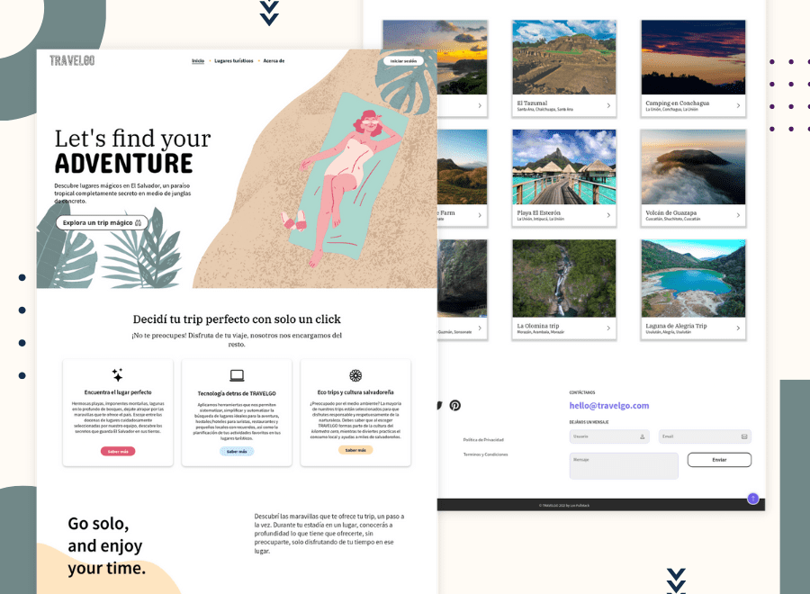

  [![Issues][issues-shield]][issues-url] &nbsp;
  [![MIT License][license-shield]][license-url] &nbsp;
   &nbsp;
   &nbsp;

 
  
  <h2 align="center">Proyecto de Programación Web</h2>
  

    Proyecto de Programación Web
     
    <a href="https://github.com/Programacion-Web-02-2022/proyecto-grupo-de-trabajo-27-los-fullstack/issues">Reportar Error</a>
    ·
    <a href="https://github.com/Programacion-Web-02-2022/proyecto-grupo-de-trabajo-27-los-fullstack/issues">Solicitar Característica</a>
  

 
 

## Acerca del Proyecto

Proyecto de Programación Web 

<!-- BUILT WITH -->
## :hammer: Tecnologías

Lista de tecnologías utilizadas en este proyecto.

### Front-End
 &nbsp;
 &nbsp;
 &nbsp;
 &nbsp;

### Back-End
 &nbsp;
 &nbsp;
 &nbsp;
 &nbsp;
 &nbsp;
 &nbsp;

### Database Design
 &nbsp;

### Test the API

### Aditionally
 &nbsp;
 &nbsp;
 &nbsp;
 &nbsp;

(<a href="#top">back to top</a>)

<!-- documentación -->
## :memo: Documentación

- [[Documento] 01 - Definición del proyecto.pdf](https://drive.google.com/file/d/1o9fUTMX2PNPHBia2zzQ6SrJDkOFwaSKN/view?usp=sharing)
- [[Documento] 02 - Prototipo de la aplicación.pdf](https://drive.google.com/file/d/1qF6r2XBzdWuuJ54xCnAPtfaoM6DorMe1/view?usp=sharing)
- [[Documento] 02.1 - Branding.pdf](https://drive.google.com/file/d/1extmq9J8_s92Ot1UAdZvtYTNC90do1w0/view?usp=sharing)
- [[Documento] 03 - Diccionario de datos.pdf](https://drive.google.com/file/d/12DHkTEVa7652uMemu-pdBNfOpC2_5tCS/view?usp=sharing)
- [[Documento] 04 - Diagramas UML de casos de uso.pdf](https://drive.google.com/file/d/1hxjaR_g-GfzmjPnGjQY6p7Weclr_v0_T/view?usp=sharing)
- [[Documento] 05 - Manual de usuario.pdf](https://drive.google.com/file/d/1ahSu21mzNV1BGOyW9QgMrIIBzQlUefwS/view?usp=sharing)
- [Carpeta contenedora de documentos](https://drive.google.com/drive/folders/1TVu6Fqgzc5ul_Z63fria0BxNfTJXVlQ-?usp=sharing)

 

- [Diseños en Figma](https://www.figma.com/file/1lLqBg4BEUuq3whFCkACwx/UI%2FUX-Design?node-id=136%3A53511)
- [Documentación de Insomnia](https://travel-go-doc-api.vercel.app/)

<!-- Prerrequisitos -->
## Prerrequisitos

* NPM
* YARN

 

(<a href="#top">back to top</a>)

<!-- LICENSE -->
## Licencia

Distribuido bajo MIT License. Ver `LICENSE.txt` para más información.

 

(<a href="#top">back to top</a>)

## Usuario de prueba

### Usuario
adminTravelGo@gmail.com

### Contraseña
rootpassword02

 

(<a href="#top">back to top</a>)

<!-- TEAM -->
### Miembros del equipo

Fernanda Vásquez  | Melvin Aguilar | Henry Escobar
:---: | :---: | :---:
  |  | 
[Ir a Github](https://github.com/cam-vasquez)  | [Ir a Github](https://github.com/MelvinAguilar) | [Ir a Github](https://github.com/HenryLima07)

 

(<a href="#top">back to top</a>)

<!-- MARKDOWN LINKS & IMAGES -->
[issues-shield]: https://img.shields.io/badge/Report%20an-Issue-important.svg?style=for-the-badge
[issues-url]: https://github.com/Programacion-Web-02-2022/proyecto-grupo-de-trabajo-27-los-fullstack/issues
[license-shield]: https://img.shields.io/badge/License%20-MIT-57b9d3.svg?style=for-the-badge
[license-url]: https://github.com/Programacion-Web-02-2022/proyecto-grupo-de-trabajo-27-los-fullstack/blob/main/LICENSE
